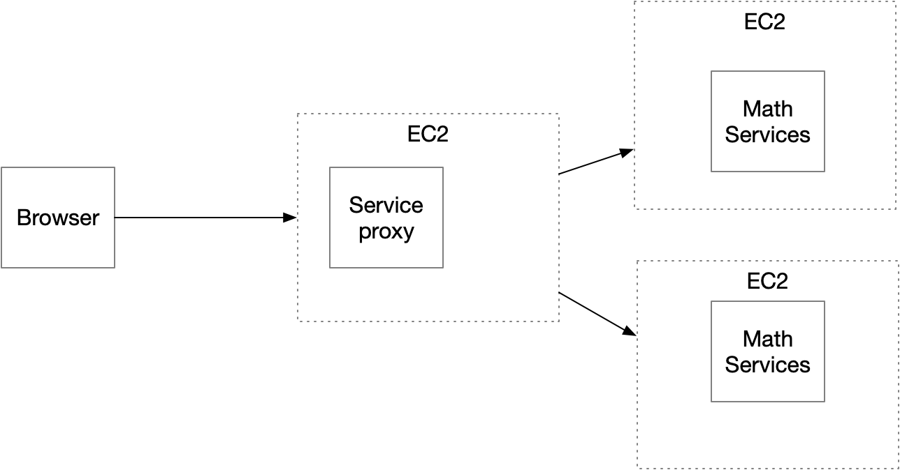

# parcial-2do-tercio

Enunciado

Diseñe, construya y desplegue una aplicación web para investigar el problema matemático asignado. El programa debe estar desplegado en AWS. Las tecnologías usadas en la solución deben ser Maven, Git, GitHub, Spring, HTML5 y js. No use liberías adicionales.

Desactive cualquier agente de IA de su IDE.
Solo use la documentación autorizada por el profesor.
No copie código existente ni suyo ni de otras fuentes ni generado por IA. Todo el entregable debe ser original, creado en la clase por usted.
Documentación autorizada:
https://docs.oracle.com/javase/8/docs/api/
https://spring.io/guides/gs/rest-service
https://docs.aws.amazon.com/corretto/latest/corretto-17-ug/amazon-linux-install.html
AWS Academy
AWS
Problema:
Diseñe un prototipo de sistema de microservicios que tenga un servicio (En la figura se representa con el nombre Math Services) para computar las funciones numéricas.  El servicio de las funciones numéricas debe estar desplegado en al menos dos instancias virtuales de EC2. Adicionalmente, debe implementar un service proxy que reciba las solicitudes de llamado desde los clientes  y se las delegue a las dos instancias del servicio numérico usando un algoritmo de round-robin. El proxy deberá estar desplegado en otra máquina EC2. Asegúrese de poder configurar las direcciones y puertos de las instancias del servicio en el proxy usando variables de entorno del sistema operativo.  Finalmente, construya un cliente Web mínimo con un formulario que reciba el valor y de manera asíncrona invoke el servicio en el PROXY. Puede hacer un formulario para cada una de las funciones. El cliente debe ser escrito en HTML y JS.

Detalles adicionales de la arquitectura y del API
Construya una aplicación web para investigar este problema. La aplicación debe tener esta arquitectura:
Cliente asíncrono que corra en el browser escrito en HTML5 y JS (No use librerías, solo html JS básico).
El cliente NO COMPUTA LA SECUENCIA DIRECTAMENTE, sino que la delega a un servicio REST corriendo en AWS.
El servicio REST puede ser GET o POST.
Se debe construir la aplicación usando Spring Boot y desplegarla en un contenedor corriendo en AWS.
Cree un solo repositorio en github para toda la aplicación
Use los mejores estándares de diseño, arquitectura y programación.

Entregable:
1. Proyecto actualizado en github (un solo repositorio)
2. Descripción del proyecto en el README con pantallazos que muestren el funcionamiento.
3. Descripción de cómo correrlo en EC2.
4. Video de menos de un minuto del funcionamiento (lo puede tomar con el celular una vez funcione)

En el campo de texto escriba la dirección de su repositorio GITHUB.
Ayuda
Para invocar un servicios get desde java puede hacerlo de manera fácil con:

import java.io.BufferedReader;
import java.io.IOException;
import java.io.InputStreamReader;
import java.io.OutputStream;
import java.net.HttpURLConnection;
import java.net.URL;

public class HttpConnectionExample {

    private static final String USER_AGENT = "Mozilla/5.0";
    private static final String GET_URL = "https://www.alphavantage.co/query?function=TIME_SERIES_DAILY&symbol=fb&apikey=Q1QZFVJQ21K7C6XM";

    public static void main(String[] args) throws IOException {

        URL obj = new URL(GET_URL);
        HttpURLConnection con = (HttpURLConnection) obj.openConnection();
        con.setRequestMethod("GET");
        con.setRequestProperty("User-Agent", USER_AGENT);
        
        //The following invocation perform the connection implicitly before getting the code
        int responseCode = con.getResponseCode();
        System.out.println("GET Response Code :: " + responseCode);
        
        if (responseCode == HttpURLConnection.HTTP_OK) { // success
            BufferedReader in = new BufferedReader(new InputStreamReader(
                    con.getInputStream()));
            String inputLine;
            StringBuffer response = new StringBuffer();

            while ((inputLine = in.readLine()) != null) {
                response.append(inputLine);
            }
            in.close();

            // print result
            System.out.println(response.toString());
        } else {
            System.out.println("GET request not worked");
        }
        System.out.println("GET DONE");
    }

}

Para invocar servicios rest de forma asíncrona desde un cliente JS
<!DOCTYPE html>
<html>
<head>
<title>Form Example</title>
<meta charset="UTF-8">
<meta name="viewport" content="width=device-width, initial-scale=1.0">
</head>
<body>
<h1>Form with GET</h1>
<form action="/hello">
<label for="name">Name:</label> 
<input type="text" id="name" name="name" value="John">  
<input type="button" value="Submit" onclick="loadGetMsg()">
</form>

<h1>Form with POST</h1>
<form action="/hellopost">
<label for="postname">Name:</label> 
<input type="text" id="postname" name="name" value="John">  
<input type="button" value="Submit" onclick="loadPostMsg(postname)">
</form>

</body>
</html>
3. Aplicación Spring mínima

-------
package co.edu.eci.lambda.springrest;

import java.util.concurrent.atomic.AtomicLong;

import org.springframework.web.bind.annotation.GetMapping;
import org.springframework.web.bind.annotation.RequestParam;
import org.springframework.web.bind.annotation.RestController;

@RestController
public class GreetingController {

private static final String template = "Hello, %s!";
private final AtomicLong counter = new AtomicLong();

@GetMapping("/greeting")
public Greeting greeting(@RequestParam(value = "name", defaultValue = "World") String name) {
return new Greeting(counter.incrementAndGet(), String.format(template, name));
}
}
-------
package co.edu.eci.lambda.springrest;

import org.springframework.boot.SpringApplication;
import org.springframework.boot.autoconfigure.SpringBootApplication;

@SpringBootApplication
public class RestServiceApplication {

public static void main(String[] args) {
SpringApplication.run(RestServiceApplication.class, args);
}

}
---------
package co.edu.eci.lambda.springrest;

public record Greeting(long id, String content) { }

    4. Ejemplo pom.xml de Spring con plugins
<?xml version="1.0" encoding="UTF-8"?>
<project xmlns="http://maven.apache.org/POM/4.0.0" xmlns:xsi="http://www.w3.org/2001/XMLSchema-instance"
xsi:schemaLocation="http://maven.apache.org/POM/4.0.0 https://maven.apache.org/xsd/maven-4.0.0.xsd">
<modelVersion>4.0.0</modelVersion>
<parent>
<groupId>org.springframework.boot</groupId>
<artifactId>spring-boot-starter-parent</artifactId>
<version>3.3.0</version>
<relativePath/> <!-- lookup parent from repository -->
</parent>
<groupId>com.example</groupId>
<artifactId>rest-service-complete</artifactId>
<version>0.0.1-SNAPSHOT</version>
<name>rest-service-complete</name>
<description>Demo project for Spring Boot</description>
<properties>
<java.version>17</java.version>
</properties>
<dependencies>
<dependency>
<groupId>org.springframework.boot</groupId>
<artifactId>spring-boot-starter-web</artifactId>
</dependency>

<dependency>
<groupId>org.springframework.boot</groupId>
<artifactId>spring-boot-starter-test</artifactId>
<scope>test</scope>
</dependency>
</dependencies>

<build>
<plugins>
<plugin>
<groupId>org.springframework.boot</groupId>
<artifactId>spring-boot-maven-plugin</artifactId>
</plugin>
</plugins>
</build>

</project>